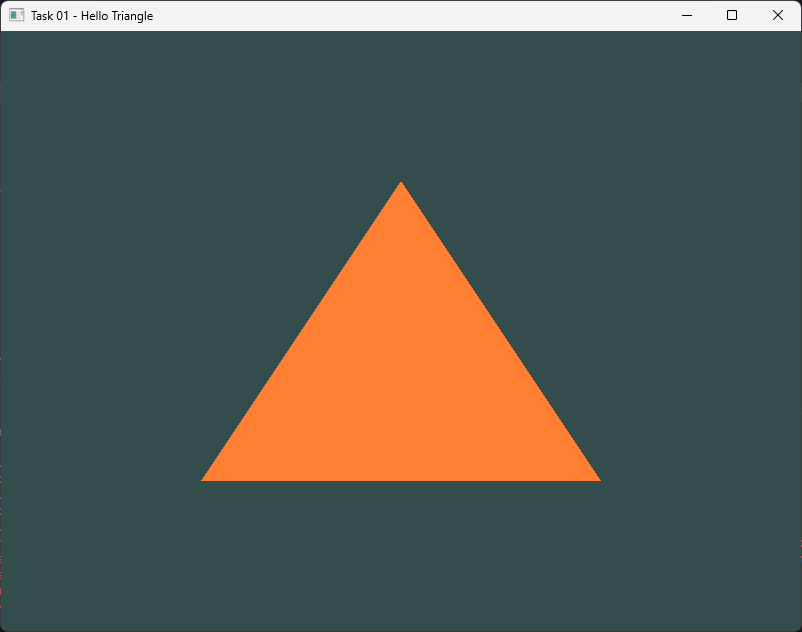

# Task 01 — Hello Triangle

> Follow the tutorial presented in <https://learnopengl.com/Getting-started/Hello-Triangle> to render a triangle.
> Create a GitHub repository to add your solutions of the different tasks. Submit the repository link.

**Status:** ✅ done

## Result



## What it does

Opens an 800×600 window with an OpenGL 3.3 core context and renders a single
colored triangle: vertex + fragment shader, one VBO with three vertices,
one VAO describing the layout, `glDrawArrays(GL_TRIANGLES, 0, 3)`.

Everything lives in `src/main.cpp`; the shaders are inline raw string literals
so the task stays a single file.

## Controls

| Key | Action |
|-----|--------|
| `ESC` | Quit |

## Run

```sh
cmake --build --preset <preset> --target task01
./build/<preset>/task-01-hello-triangle/task01
```

## Notes / what I learned

- The vertex data is given in **normalized device coordinates**: the visible
  volume is `[-1, 1]` on every axis, so no matrices are needed yet.
- A VBO only stores bytes; the VAO is what remembers *how to read them* —
  `glVertexAttribPointer` records the layout into the currently bound VAO, so
  the VAO must be bound first.
- Shader compilation and program linking fail silently unless you query
  `GL_COMPILE_STATUS` / `GL_LINK_STATUS` and read the info log.
- After linking, the individual shader objects can be deleted: the program
  keeps its own copy of the compiled code.
- The framebuffer size callback keeps `glViewport` in sync when the window is
  resized; without it the triangle stretches.
