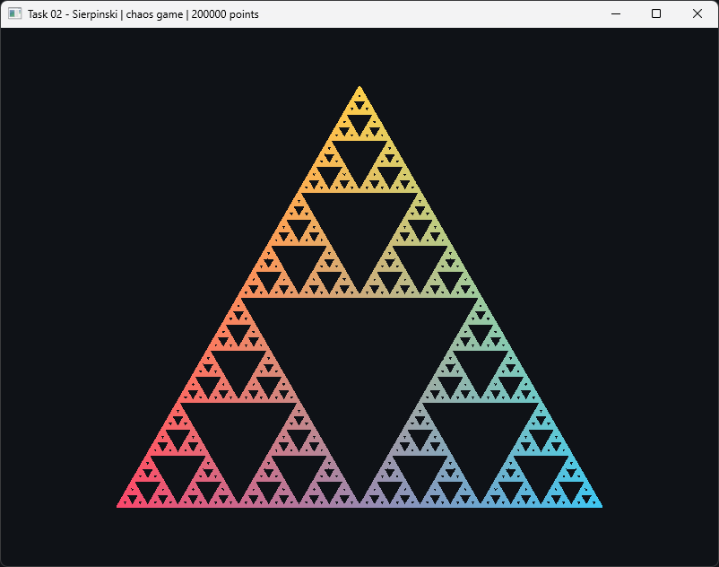
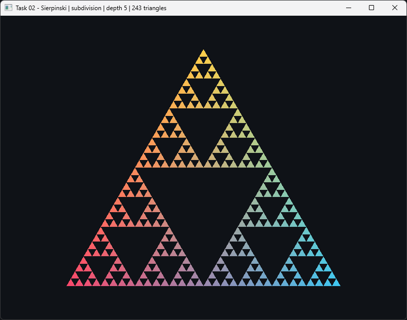

# Task 02 — Sierpinski Triangle

> Draw a [Sierpinski triangle](https://en.wikipedia.org/wiki/Sierpi%C5%84ski_triangle)
> using the triangle base code. You can recursively draw it up to *n* levels,
> but there is also a random point-wise version to implement:
>
> 1. Pick an initial point p = (x, y) at random inside the triangle.
> 2. Select one of the three vertices at random.
> 3. Find the point q halfway between p and the randomly selected vertex.
> 4. Display q by putting some sort of marker (e.g. a small circle) at that location.
> 5. Replace p with q. Return to step 2.

**Status:** ✅ done

## Result

Chaos game, 200 000 points:



Recursive subdivision, depth 5 (243 triangles):



## Approach

Both methods are in `src/main.cpp` and share the same vertex shader; `SPACE`
switches between them.

- **Chaos game (point-wise).** The initial point is sampled uniformly inside
  the triangle using barycentric weights `(1-s, s(1-t), st)` with `s = √u`;
  the square root is what makes the sample uniform over *area* rather than
  over parameter space. Then the loop of the statement runs: pick one of the
  three vertices at random, move halfway, plot. The first 20 iterates are
  discarded — the attractor is only reached in the limit, and those early
  points would otherwise land inside the holes.

  Points accumulate into a preallocated `GL_DYNAMIC_DRAW` buffer, 2 000 per
  frame up to 200 000, appended with `glBufferSubData`. That is what makes the
  fractal visibly emerge from noise instead of appearing all at once.

- **Recursive subdivision.** Each triangle is split by its edge midpoints into
  four; the three corner ones recurse and the middle one is dropped — it *is*
  the hole. Depth `n` yields 3ⁿ filled triangles, rebuilt into a
  `GL_STATIC_DRAW` buffer only when the depth changes.

- **Positional color.** Both modes share one vertex shader that assigns each
  corner of the triangle a color and blends them by the barycentric weights of
  the position being drawn. The weights come from a single `mat2` uniform — the
  inverse of `[v1-v0, v2-v0]`, precomputed once on the CPU — so no color has to
  be stored per vertex and both modes end up with the exact same palette.

Two fragment shaders are compiled: the chaos game discards fragments outside
`length(gl_PointCoord - 0.5) > 0.5` to turn each square point sprite into the
round marker the statement asks for, while the subdivision fills solid
triangles. Reading `gl_PointCoord` while rasterizing triangles is undefined, so
they cannot be the same shader.

The window title reports the current mode, point count and depth.

## Controls

| Key | Action |
|-----|--------|
| `SPACE` | Switch chaos game ↔ recursive subdivision |
| `R` | Restart the chaos game from a new random seed point |
| `↑` / `↓` | Recursion depth, 0–8 (subdivision mode) |
| `ESC` | Quit |

## Run

```sh
cmake --build --preset <preset> --target task02
./build/<preset>/task-02-sierpinski-triangle/task02
```

## Notes / what I learned

- Interpolating three corner colors by barycentric weights is exactly what the
  rasterizer does for free across a triangle — doing it in the vertex shader
  just extends the same idea to isolated points, which have no triangle to
  interpolate across.
- The two modes converge to the same picture but not for the same reason: the
  chaos game approximates the *measure* of the attractor with point density,
  while subdivision produces the exact geometry at a finite depth. That is why
  the subdivision has crisp edges and the chaos game a grainy texture.
- The chaos game is **affine invariant**: the attractor is the Sierpinski
  gasket of whatever triangle you feed it, so the vertices need not be
  equilateral for the fractal to be correct. The `uScale` uniform is purely
  cosmetic — it stops the shape from stretching when the window is resized.
- Sampling a triangle uniformly is not `w = (r0, r1, 1-r0-r1)`: that
  concentrates points near one corner. The `√` trick is the cheap fix.
- `glBufferData(..., nullptr, GL_DYNAMIC_DRAW)` reserves storage without
  uploading anything, so the buffer can be filled incrementally with
  `glBufferSubData` — no reallocation per frame.
- `glPointSize` still exists in 3.3 core; only the *shader-driven* variant
  needs `glEnable(GL_PROGRAM_POINT_SIZE)`.
- Discrete key presses belong in a `glfwSetKeyCallback`, not in the polling
  `glfwGetKey` used for continuous input in task 01: polling a toggle would
  flip it once per frame while the key is held.
