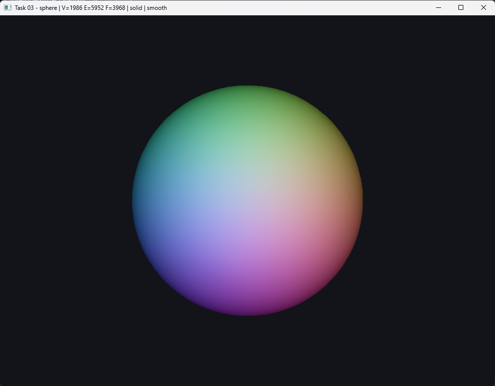
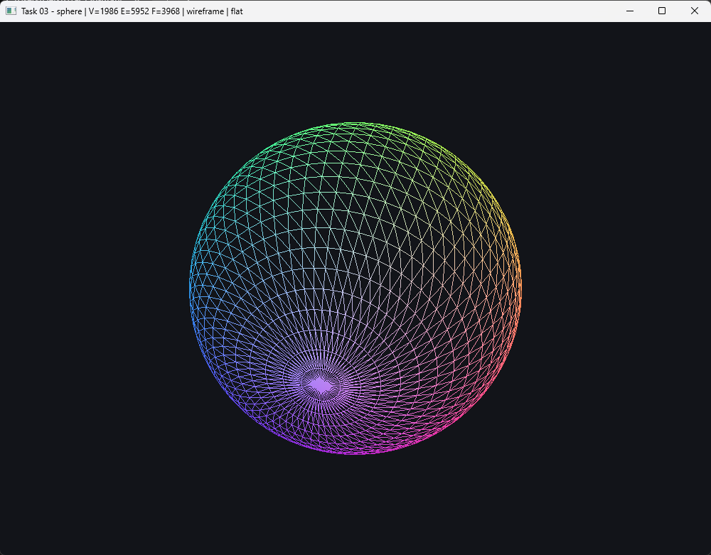
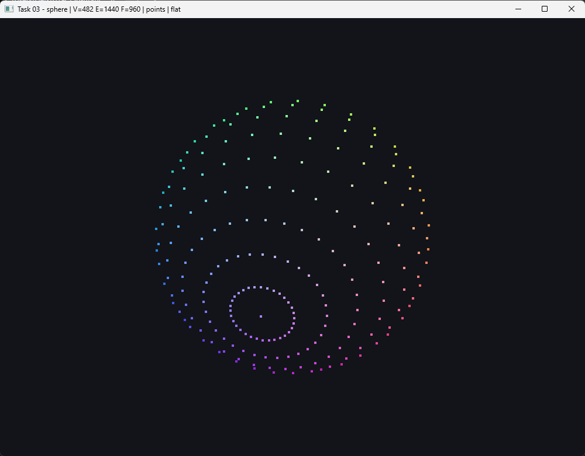
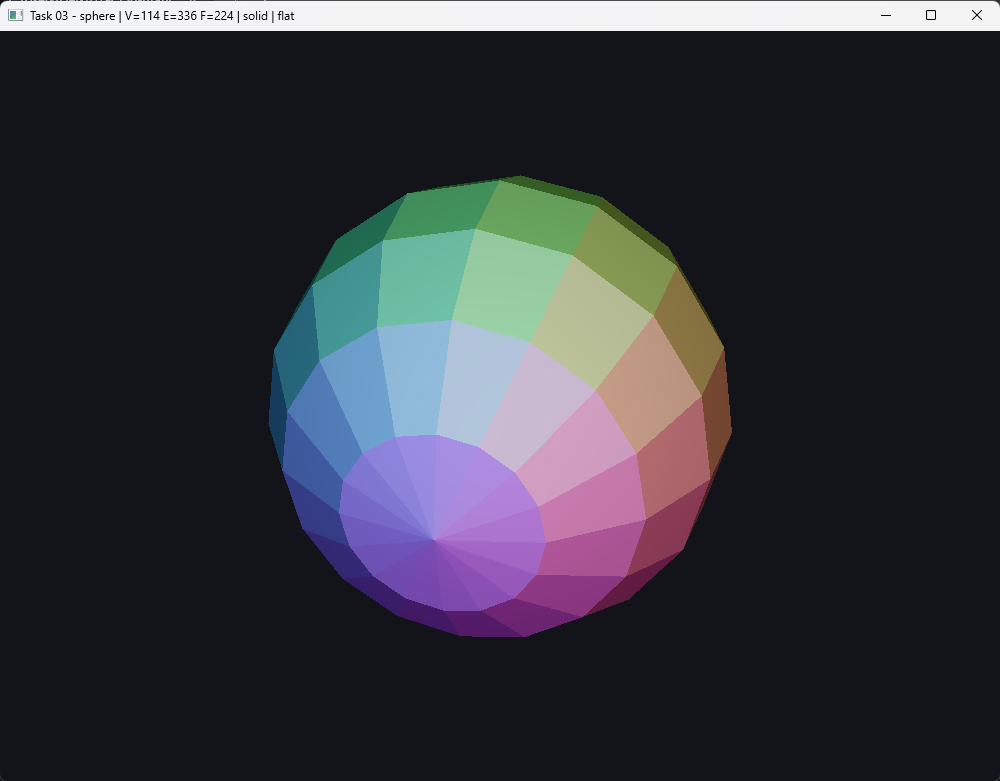
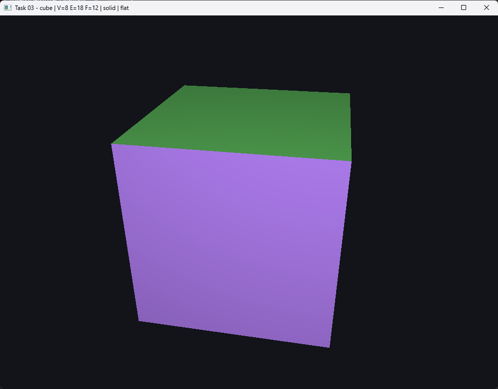

# Task 03 — Sphere

> Create the surface of a sphere defined by a set of vertices and triangles (or faces).
>
> - Implement the CHE data structure to store the mesh's geometry and connectivity, and test it with a cube first.
> - Use the parametric equation for the sphere to define the positions of the vertices. The number of vertices or the resolution of the sphere could be set.
> - Define the triangles and their vertices; a vertex can be shared by multiple triangles.
> - Use your CHE data structure to store your sphere.
> - To render your sphere in OpenGL, you will need to define a new VBO for the indices of the vertices to render their corresponding triangles.
> - Add color to your sphere, add options to render only the points or the mesh wireframe, and configure keyboard interactions.

**Status:** ✅ done

## Result

Sphere at 64×32, smooth normals — 1 986 vertices, 3 968 triangles:



Wireframe and vertices only, at the same and at half resolution:





Flat shading at 16×8 exposes the actual tessellation, including the triangle
fan that closes each pole:



The cube built first as a test — 8 shared vertices, 12 triangles:



## The CHE

`src/che.hpp` implements the compact half-edge structure of Lage, Lewiner,
Lopes and Velho at **level L1**, with the names used in class:

| | |
|---|---|
| `G[v]` | geometry array — position of vertex `v` |
| `V[he]` | vertex array — vertex at the origin of half-edge `he` |
| `O[he]` | opposite array — half-edge glued to `he`, `NIL = -1` on a boundary |

Triangle `t` owns half-edges `3t`, `3t+1`, `3t+2`, so the parent triangle is
just `he/3` and **no face array is stored at all**. Navigation is index
arithmetic with no lookup:

```cpp
trig(he) = he / 3
next(he) = 3*(he/3) + (he + 1) % 3
prev(he) = 3*(he/3) + (he + 2) % 3
twin     = O[he]
```

L0 is `G` and `V` alone — a triangle soup. **L1 adds `O`**, and that single
array is what turns the soup into a surface: it is the only thing that lets you
walk from a triangle to its neighbour, which is what `star()` and `link()` are
built on and what task 04 will need for edge collapse.

`O` is built once in `O(F)` by hashing each directed edge `(V[he], V[next(he)])`
and pairing it with its reverse.

Because L1 has no vertex→half-edge map (that is L2/L3), `star()` and `link()`
take a **half-edge**, not a vertex. This is not a limitation worked around —
it is what L1 means, and every caller naturally has a half-edge in hand.

## The sphere

`P(u, v) = r (cos u sin v, sin u sin v, cos v)`, with `u` the azimuth over
`[0, 2π)` and `v` the colatitude over `[0, π]`, exactly as given in class.

Two details decide whether the result is a valid closed manifold or not:

- **The seam.** The ring at `u = 2π` is never emitted; the last column wraps
  around to column 0 with `j % slices`. Emitting it would place two distinct
  vertices at the same point, and the CHE would see a **boundary** running down
  the sphere — `O` would fill with `NIL`.
- **The poles.** Each pole is a **single** vertex closed by a triangle fan.
  A ring of vertices there would produce zero-area triangles.

Get either wrong and `is_closed()` is false and Euler's characteristic is not 2.
Both are checked below.

Resolution is set with `↑`/`↓`, which doubles or halves the slice count between
3 and 256. Stacks are half the slices, since `u` spans 2π but `v` only π, which
keeps the quads roughly square.

## Rendering

The point of storing connectivity over a shared vertex array is that **`V` is
already the index buffer**: it goes to the `GL_ELEMENT_ARRAY_BUFFER` unchanged
and is drawn with `glDrawElements`. Positions and vertex normals are
interleaved in a second VBO.

Color is the normal direction itself, `0.5 + 0.5 * n`, so the orientation of
every face is readable at a glance. The two shading modes differ in where `n`
comes from:

- **smooth** — area-weighted vertex normals, averaged over the star.
- **flat** — the true face normal, recovered per fragment from
  `cross(dFdx(worldPos), dFdy(worldPos))`. This matters: the honest way to get
  faceted shading is to duplicate vertices per face, which would destroy the
  shared-vertex connectivity the whole CHE depends on. Screen-space derivatives
  give the same picture without touching the mesh.

Wireframe and point modes skip the diffuse term — shading a line by its normal
only makes it vanish.

## Controls

| Key | Action |
|-----|--------|
| `SPACE` | Cube ↔ sphere |
| `1` / `2` / `3` | Solid · wireframe · points |
| `S` | Flat ↔ smooth shading |
| `↑` / `↓` | Double / halve the sphere resolution |
| `A` | Toggle auto-rotation |
| Drag / scroll | Orbit the camera · zoom |
| `ESC` | Quit |

## Run

```sh
cmake --build --preset <preset> --target task03
./build/<preset>/task-03-sphere/task03

./build/<preset>/task-03-sphere/task03 --check   # validate the CHE, no window
```

## Validation

`--check` runs the structural invariants instead of opening a window, and the
renderer validates every mesh it builds:

```
cube           V=     8 E=    18 F=    12  euler=2  closed=y outward=y stars=y  PASS
sphere 3x2     V=     5 E=     9 F=     6  euler=2  closed=y outward=y stars=y  PASS
sphere 8x4     V=    26 E=    72 F=    48  euler=2  closed=y outward=y stars=y  PASS
sphere 16x8    V=   114 E=   336 F=   224  euler=2  closed=y outward=y stars=y  PASS
sphere 32x16   V=   482 E=  1440 F=   960  euler=2  closed=y outward=y stars=y  PASS
sphere 64x32   V=  1986 E=  5952 F=  3968  euler=2  closed=y outward=y stars=y  PASS
sphere 128x64  V=  8066 E= 24192 F= 16128  euler=2  closed=y outward=y stars=y  PASS
radial deviation from the analytic sphere: 1.192e-07
all checks passed
```

What each column proves:

- **euler = 2** — `V - E + F` for a sphere. Catches a torn seam or a duplicated
  pole immediately.
- **closed** — not one `O[he] == NIL`, so the surface has no boundary.
- **outward** — every face normal points away from the origin, so the winding
  is consistent.
- **stars** — every half-edge leaving a vertex reports the same fan, and the
  fans sum to `3F`.
- Plus, inside `validate()`: `O[O[he]] == he`, no half-edge opposite to itself,
  no degenerate edges, and matching orientation across every shared edge.

`sphere 3x2` is the degenerate extreme — a triangular bipyramid with no middle
band — and it closes too. The radial deviation is at `float` epsilon, so the
parametrization is exact.

## Notes / what I learned

- The whole value of L1 is one array. `O` is 4 bytes per half-edge and it is
  the difference between a bag of triangles and a surface you can walk.
- Storing no faces at all still feels wrong and is completely fine: `he/3` is
  the face, and the three half-edges are contiguous by construction.
- A cube with 8 shared vertices *cannot* have per-face normals in the vertex
  data — a corner belongs to three faces at once. Either you duplicate vertices
  and lose the connectivity, or you rebuild the normal in the fragment shader.
- Euler's characteristic is a remarkably cheap test. Any seam or pole mistake
  in the sphere generator changes `V`, `E` or `F` and it stops being 2.
- `glPolygonMode` gives wireframe and point rendering for free from the same
  index buffer — no separate line geometry needed.
