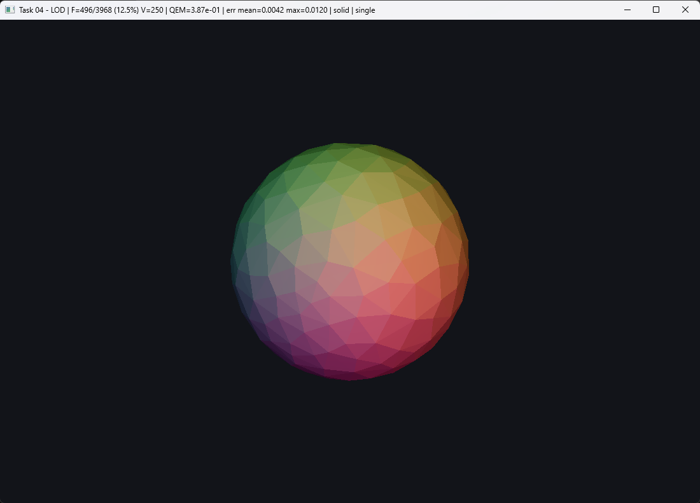
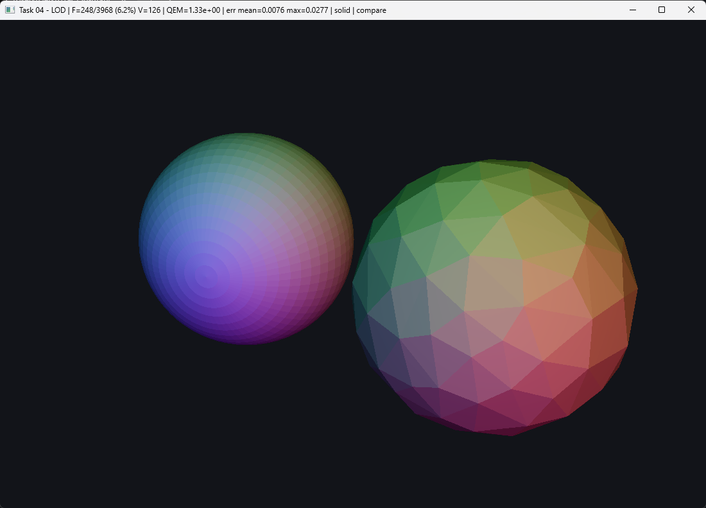
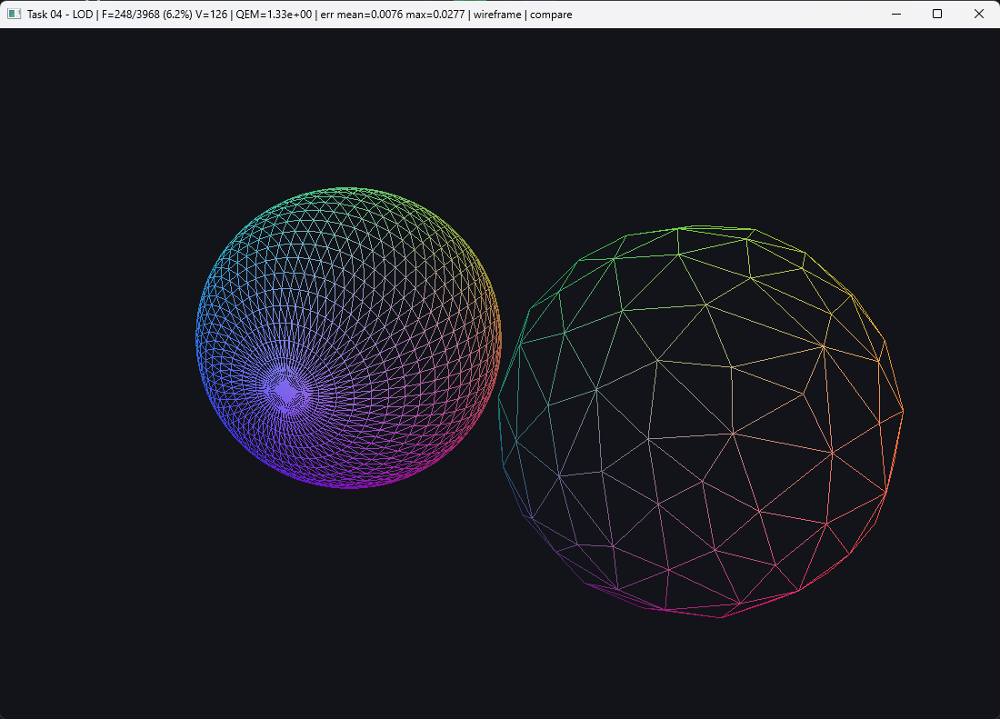
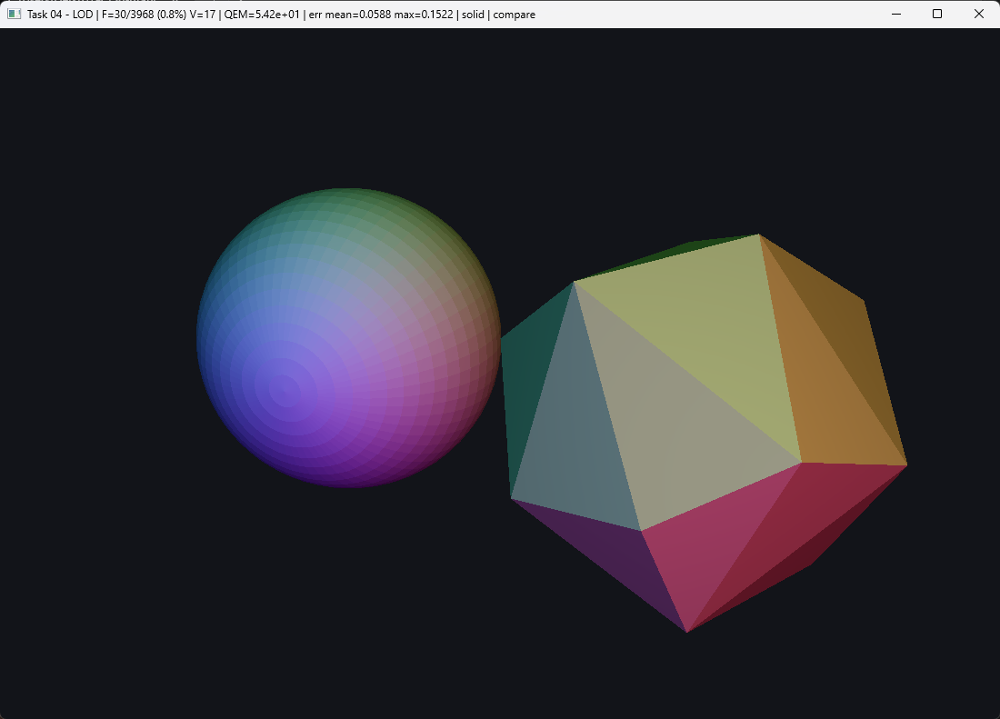
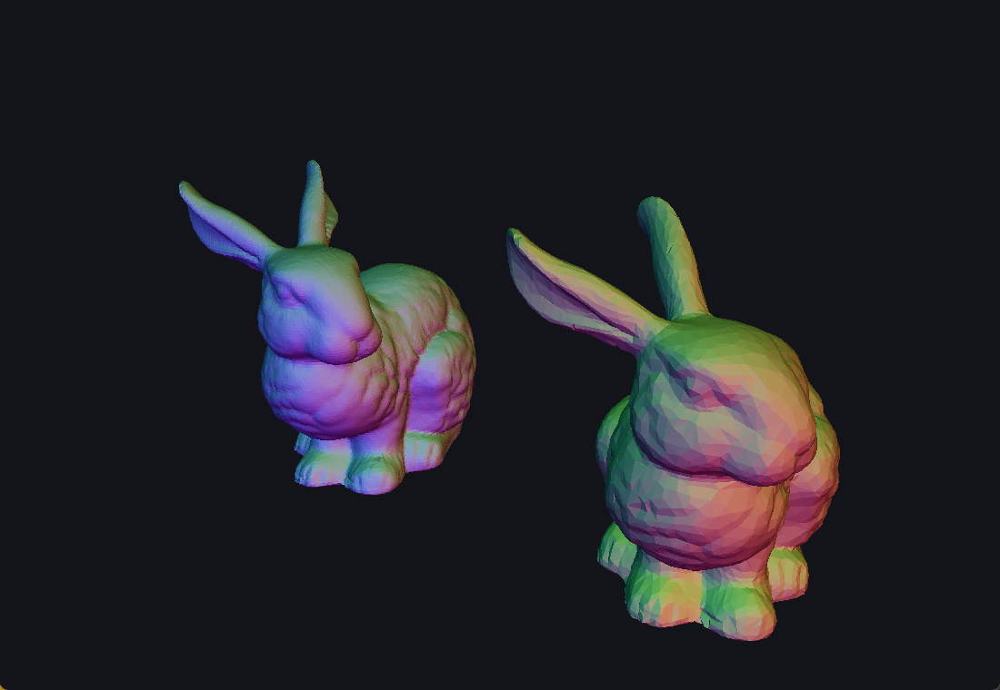

# Task 04 — Mesh Simplification (LOD)

> Implementing LOD for rendering and other mesh processing operations is important.
> Implement your own version of the mesh simplification algorithm presented in class,
> using the original paper as the main reference.
>
> - Your mesh simplification algorithm should be implemented within your CHE.
> - Your CHE should be an L1 implementation; later, we will have a task where the traversal operation will be critical.
> - Evaluate the error against the original mesh.
> - Submit an image of your simplified sphere, and don't forget to update your repository, you can add more samples there.

**Status:** ✅ done

## Result

The sphere of task 03 reduced to 12.5% of its triangles — 496 of 3 968:



Original (left) beside the same sphere at 6.2%, 248 triangles:



The wireframe shows what the algorithm actually did. The parametric sphere
wastes triangles on the poles, where the UV grid collapses into a dense fan;
QEM spends them where they buy curvature instead, so the simplified mesh is
almost uniform and the pole fan is gone:



Pushed to 0.8% — 30 triangles, 17 vertices — and still recognisably a sphere:



The Stanford bunny loaded from `.ply`, original (left) and at 12.5% — 8 681 of
69 451 triangles. Flat shading shows the facets; the silhouette barely moves:



## Algorithm

`src/che_simplify.cpp`, as methods of `CHE`. Garland & Heckbert, *Surface
Simplification Using Quadric Error Metrics*, SIGGRAPH 1997.

**1. A quadric per vertex.** Each face contributes `K = p pᵀ` for its plane
`p = [a b c d]`, normalized so `a²+b²+c² = 1`. Summing over incident faces gives
a 4×4 symmetric `Q` for which `vᵀQv` is the total squared distance from `v` to
those planes.

**2. Cost and position of a collapse.** For edge `(u, w)`, `Q̄ = Qu + Qw`. The
position minimizing `E(v̄) = v̄ᵀQ̄v̄` comes from `∇E = 0`, which is the linear
system obtained by replacing the last row of `Q̄` with `[0 0 0 1]` and solving
against `[0 0 0 1]ᵀ`. When `Q̄` is singular — flat or symmetric neighbourhoods,
where the minimum is not a single point — it falls back to the best of `u`, `w`
and their midpoint, as the paper suggests.

**3. Cheapest first.** A priority queue over the edges. After a collapse only
the edges meeting the surviving vertex change price, so those are re-pushed.
Stale entries are not hunted down in the heap: each candidate records its
endpoints and a per-vertex version counter, and is discarded when it surfaces
with either out of date.

## Doing it inside an L1 CHE

**The collapse is index surgery.** Collapsing the edge at `he` kills exactly two
triangles — `trig(he)` and `trig(O[he])` — and one vertex. The work is:

```
G[u] = optimal position          the survivor moves
V[h] = u   for h in star(w)      w's half-edges are relabelled
O[O[a]] = O[b], O[O[b]] = O[a]   the neighbours of each dying triangle
                                 are glued directly to each other
```

Everything the repair needs is read **before** the mesh is touched, because
reading `O` after relabelling would follow links that no longer mean anything.

**Nothing is erased during the loop.** Removing entries from `G` and `V` would
be O(n) per collapse and would invalidate every index in the queue. Instead the
dead triangles are marked, and a single `compact()` at the end rebuilds `G` and
`V` from the surviving triangles, remaps the indices and re-runs
`build_opposites()`. A vertex survives if a surviving triangle still uses it,
so the result is a fresh, valid L1 CHE even when the input was not quite
manifold — which is why `validate()` passes on every level below.

**Two guards.** QEM by itself does not know about topology:

- **Link condition.** If the endpoints share any neighbour other than the two
  vertices opposite the edge, the collapse pinches two sheets together and the
  result is no longer a manifold. Checked with `link()` on both endpoints.
  Boundary edges are never collapsed.
- **Normal flip.** Moving the survivor to the optimal position can turn a
  neighbouring face inside out. Every surviving triangle in both stars is
  compared before and after; a negative dot product rejects the collapse.

`--check` counts how often each guard fires. On the sphere: never, at any
level. On the torus the flip guard starts rejecting below 960 triangles and the
link condition fires 25 times at the very end, which is what stops it at 18
triangles instead of collapsing through its handle. On the bunny both fire
hundreds of times from the first level on.

The floor is the **tetrahedron**. Below 4 triangles a closed surface stops
existing, so the loop stops there regardless of the target.

**`star()` and `link()` take a half-edge**, not a vertex, because L1 has no
vertex→half-edge map. That is not worked around anywhere: the collapse always
has a half-edge in hand, which is exactly why L1 is enough for this algorithm.

## Evaluating the error

Two independent measures, because each one alone can be misleading.

**The QEM cost** is free — it is the quantity the algorithm minimizes, summed
over every collapse. It measures distance to the *original planes*, which is
what was optimized, so it is a fair progress metric but not an independent one.

**A sampled Hausdorff distance** against the original mesh, measured
**in both directions**: vertices of each mesh to the closest point on the
*surface* of the other, using point-to-triangle distance rather than
vertex-to-vertex, which would overestimate. At most 2 000 vertices per
direction are sampled, so a 70 000-triangle mesh still takes a couple of
seconds per level.

Both directions matter. Measuring only simplified → original is misleading:
simplifying a cube down to a tetrahedron leaves every surviving vertex exactly
on the original surface, so the forward distance is **zero** while the shape is
badly wrong. The reverse direction catches it.

## LOD ladder

From `task04 sphere --check`, sphere 64×32, radius 1:

| target | V | F | Euler | collapses | QEM sum | QEM max | err mean | err max |
|---|---|---|---|---|---|---|---|---|
| 3968 | 1986 | 3968 | 2 | 0 | 0 | 0 | 0.00000 | 0.00000 |
| 1984 | 994 | 1984 | 2 | 992 | 1.94e-02 | 6.36e-05 | 0.00097 | 0.00278 |
| 992 | 498 | 992 | 2 | 1488 | 1.04e-01 | 4.20e-04 | 0.00253 | 0.00643 |
| 496 | 250 | 496 | 2 | 1736 | 3.87e-01 | 2.73e-03 | 0.00422 | 0.01197 |
| 248 | 126 | 248 | 2 | 1860 | 1.33e+00 | 1.95e-02 | 0.00758 | 0.02772 |
| 124 | 64 | 124 | 2 | 1922 | 4.36e+00 | 1.16e-01 | 0.01432 | 0.05211 |
| 62 | 33 | 62 | 2 | 1953 | 1.48e+01 | 7.42e-01 | 0.02763 | 0.08444 |
| 31 | 17 | 30 | 2 | 1969 | 5.42e+01 | 4.86e+00 | 0.05879 | 0.15218 |
| 15 | 9 | 14 | 2 | 1977 | 2.08e+02 | 4.18e+01 | 0.11884 | 0.29517 |
| 7 | 5 | 6 | 2 | 1981 | 6.71e+02 | 1.91e+02 | 0.24867 | 0.62049 |

Every level is a closed manifold with Euler characteristic 2 and passes
`validate()` — the same invariants task 03 checks, re-run on the simplified
output. Half the triangles costs **0.1% of the radius** in mean error, a
quarter costs 0.25%, and the error stays under 1% down to 124 triangles.

The same ladder on the other meshes:

| mesh | F original | F at ~3% | err mean | err max | every level valid |
|---|---|---|---|---|---|
| torus (genus 1) | 7 680 | 240 | 0.00758 | 0.02839 | ✅, Euler 0 throughout |
| Stanford bunny (open) | 69 451 | 2 169 | 0.00243 | 0.08203 | ✅ |

## Meshes

Two generated (`sphere`, `torus`) and any triangle-mesh `.ply`. The loader is
the one from task 06: [happly](https://github.com/nmwsharp/happly) (MIT, via
vcpkg) reads the file, `mesh_io.cpp` centres the model, scales its longest side
to 2 and fan-triangulates polygons. The sample models live in
`task-06-fast-marching/models/`.

## Controls

| Key / mouse | Action |
|-----|--------|
| `↓` / `↑` | Halve / double the target triangle count |
| `R` | Back to the full-resolution mesh |
| `C` | Side-by-side comparison ↔ simplified only |
| `1` / `2` / `3` | Solid · wireframe · points |
| `S` | Flat ↔ smooth shading |
| `A` | Toggle auto-rotation |
| Drop a `.ply` on the window | Load it (back to full resolution) |
| Left drag / scroll | Orbit the camera · zoom |
| `ESC` | Quit |

The title bar reports the mesh, the triangle count, the reduction, the
accumulated QEM cost and the measured error.

## Run

```sh
cmake --build --preset <preset> --target task04
./build/<preset>/task-04-simplification-algorithm/task04                            # sphere
./build/<preset>/task-04-simplification-algorithm/task04 torus
./build/<preset>/task-04-simplification-algorithm/task04 ../task-06-fast-marching/models/bunny.ply
./build/<preset>/task-04-simplification-algorithm/task04 sphere torus --check       # LOD tables, no window
```

## Layout

```
src/
├── che.hpp / che.cpp            L1 CHE, the same data structure task 06 uses
├── che_simplify.cpp             simplify(), the two guards, compact(), deviation_from()
├── primitives.hpp / .cpp        generated test meshes: make_sphere, make_torus
├── mesh_io.hpp / .cpp           load_ply(): happly -> centred, triangulated CHE
└── main.cpp                     viewer: side-by-side LOD, drag-and-drop, --check
```

## Notes / what I learned

- The quadric is the whole idea: it compresses an unbounded number of planes
  into one 4×4 matrix that can be **added**. That is what makes merging two
  vertices cost `Qu + Qw` and nothing more.
- QEM does not just remove triangles, it **redistributes** them. The UV sphere's
  worst property — thousands of slivers crammed into the poles — is exactly what
  the algorithm eliminates first, because collapsing those edges costs almost
  nothing. The simplified mesh is better shaped than the original at the same
  triangle count.
- Marking-then-compacting instead of erasing turns the whole loop into flat
  array writes, and gives a clean rebuild of `O` for free at the end.
- An error metric measured in one direction only can report zero for a mesh that
  is visibly destroyed. Symmetry is the difference between measuring something
  and measuring nothing.
- Meshes from the wild have stray vertices and pieces that touch at a point.
  Letting `compact()` decide which vertices survive from the triangles, rather
  than from a per-vertex mark, is what keeps the bunny valid at every level.
