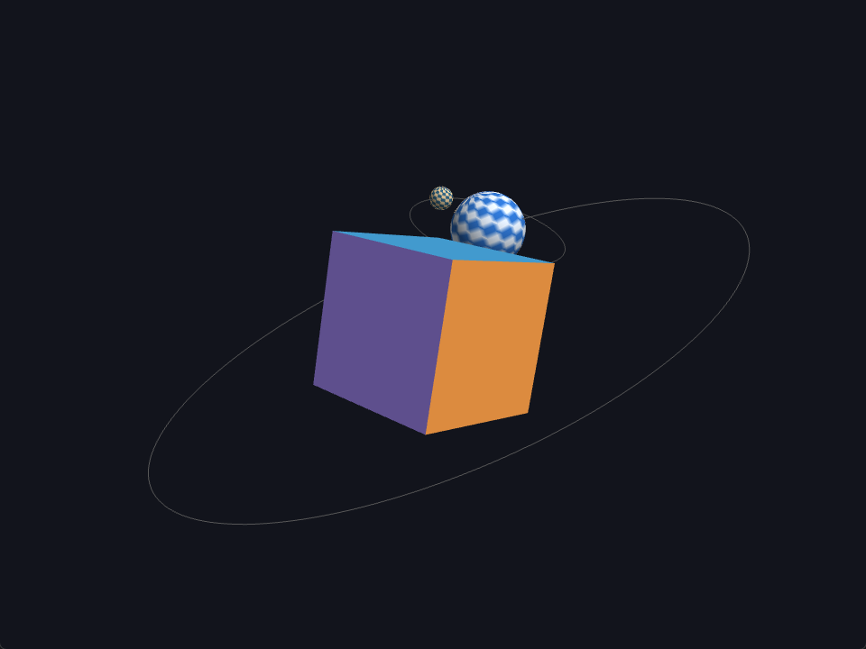

# Task 05 — Animated Scene

> In this assignment, you will create and animate a small scene.
>
> - Generate a simple scene, a cube, a small sphere.
> - Spinning the cube: use matrix transformation to animate the cube so that
>   each time it is rendered, it rotates.
> - Rotate the sphere around the cube: use matrix transformation to animate it
>   so that each time it is rendered, it orbits the cube.
> - Feel free to add colours, or different transformations or objects.
>
> Update your repository and add a link to a short video showing your animated
> scene.

**Status:** ✅ done

## Result

📹 **Video:** [`docs/animated-scene.mp4`](docs/animated-scene.mp4) — 9 s, one full
revolution of the sphere around the cube (the orbit period is 2π / 0.70 ≈ 8.98 s).



A colored cube spins about two axes at the origin. A checkered sphere orbits it
on a tilted plane while spinning on its own axis, and a small moon orbits the
sphere. The thin circles are the two orbit paths, drawn as guides.

The camera never moves: **every motion in the frame comes from a model matrix**,
which is what the statement asks for. (Animating the camera instead is task 07.)

## Approach

Everything is in `src/main.cpp`. Same skeleton as tasks 01 and 02 — context,
shaders, VBO/VAO, render loop — plus the two things 3D needs: a depth buffer,
and the model / view / projection chain.

### Geometry, generated at startup

Both meshes are built on the CPU into an interleaved
`{position, normal, color}` vertex buffer and an index buffer:

- **Cube** — 24 vertices, 36 indices. Each face gets its own four corners
  rather than sharing the cube's 8, because a corner belongs to three faces
  with three different normals and three different colors. Faces are emitted
  from a `{normal, u, v, color}` table with `u × v == normal`, which makes the
  winding counter-clockwise seen from outside without hand-checking 12
  triangles.
- **Sphere** — the parametric surface `P(u, v) = (sin v cos u, cos v, sin v sin u)`
  over 48 slices × 24 stacks. On a unit sphere the normal of a point *is* the
  point, so the normal comes for free. It is colored with a checkerboard on
  purpose: a flat-colored sphere hides its own axial spin.
- **Ring** — a unit circle in the XZ plane drawn as a `GL_LINE_LOOP`, scaled
  into each orbit. It has no indices, so it is drawn with `glDrawArrays`.

The sphere mesh is uploaded **once** and drawn **twice**, at two different
scales and with two different tints. Adding the moon costs one extra draw call
and no extra geometry.

### The transformations

The scene lives in the products below. A matrix chain reads **right to left**:
each factor acts on the frame that the factors to its right have already set up.

**Cube** — rotation only, about its own centre. Two rates that do not divide
each other, so the tumble never visibly repeats:

```cpp
cubeModel = rotateY(t * 0.80) * rotateX(t * 0.31);
```

**Sphere** — the orbit is a rotation applied *after* a translation:

```cpp
sphereAnchor = orbitPlane * rotateY(t * kOrbitSpeed) * translate(kOrbitRadius, 0, 0);
sphereModel  = sphereAnchor * rotateY(t * kSphereSpin) * scale(kSphereScale);
//             └── where it is ──┘ └──── what it does once it is there ────┘
```

Right to left: the unit sphere is shrunk, spun about its own axis, pushed out
to distance `R` along +X, and then that whole displaced frame is swung around
the origin — where the cube is. **This is the entire assignment.** Swapping the
last two factors,

```cpp
translate(R, 0, 0) * rotateY(t)   // instead of   rotateY(t) * translate(R, 0, 0)
```

gives a sphere that sits still at distance `R` and spins in place: the same two
matrices, a completely different animation. Translation and rotation do not
commute, and the orbit is exactly that non-commutativity made visible.

Everything to the left of `translate` is the *world* frame (where the body is
placed); everything to the right is the *local* frame (what it does there).
`orbitPlane` is a fixed 22° tilt so the orbit is not seen edge-on.

**Moon** — the same construction one level down, starting from `sphereAnchor`
instead of the identity:

```cpp
moonPlane = sphereAnchor * rotateX(35°);
moonModel = moonPlane * rotateY(t * kMoonSpeed) * translate(kMoonRadius, 0, 0) * scale(kMoonScale);
```

Because it is anchored to the sphere's frame, the moon follows the sphere
around the cube for free — nobody computes a combined path. That is the whole
idea of a scene graph, done by hand with three objects.

### Camera and depth

`glm::lookAt` builds the view matrix from a fixed position above and behind the
origin; `glm::perspective` builds a 45° projection from the current framebuffer
aspect ratio, requeried every frame so a resize does not stretch the scene. The
vertex shader applies the chain in one line:

```glsl
gl_Position = uProjection * uView * uModel * vec4(aPos, 1.0);
```

`glEnable(GL_DEPTH_TEST)` and clearing `GL_DEPTH_BUFFER_BIT` are what let the
sphere pass *behind* the cube. Without them the draw order decides visibility
and the sphere would stay in front for the whole orbit.

### Shading

Ambient + Lambert against one fixed directional light, with a weak fill from
behind so the far side of the orbit does not go pure black. Normals are
transformed by `transpose(inverse(mat3(model)))`, not by the model matrix:
normals are directions, and only the inverse transpose keeps them perpendicular
to the surface. The orbit guides pass `uLit = 0` and come out flat, which is
why their zero normal never matters.

## Controls

| Key | Action |
|-----|--------|
| `SPACE` | Pause / resume the animation |
| `↑` / `↓` | Animation speed, 0.1× – 4× |
| `R` | Reset the scene to t = 0 |
| `W` | Toggle wireframe |
| `O` | Toggle the orbit guides |
| `ESC` | Quit |

## Run

```sh
cmake --build --preset <preset> --target task05
./build/<preset>/task-05-transformations/task05
```

## Notes / what I learned

- **Matrix products do not commute, and the orbit is the proof.**
  `rotate * translate` orbits; `translate * rotate` spins in place. Reading a
  chain right to left — innermost factor first, in the body's own frame —
  is the only way to keep this straight.
- Composing a child transform onto a parent's (`moonPlane = sphereAnchor * …`)
  is a scene graph in miniature: the child inherits the parent's motion without
  anyone deriving the combined trajectory.
- Animate from **accumulated time**, not from a frame counter. `sceneTime +=
  deltaTime * speed` runs at the same rate on a 60 Hz and a 144 Hz display, and
  pausing becomes "stop accumulating" rather than a special case everywhere.
- Normals need `transpose(inverse(M))`, not `M`. With pure rotation and uniform
  scale the difference is invisible, which is exactly why it is worth doing
  right before a non-uniform scale ever shows up.
- `glClear(GL_COLOR_BUFFER_BIT)` alone is not enough once there is depth: a
  stale depth buffer makes the second frame reject almost everything.
- A cube cannot have 8 vertices *and* per-face flat normals. Sharing vertices
  is a property of the attributes, not of the shape — the moment two faces
  disagree on any attribute at a corner, that corner has to be duplicated.
- The element buffer binding is stored **in the VAO**, so it must be unbound
  after the VAO, never before, or the VAO forgets its indices.
- A uniformly colored sphere looks identical whether it spins or not. Making an
  animation *legible* is part of the work, not decoration.
