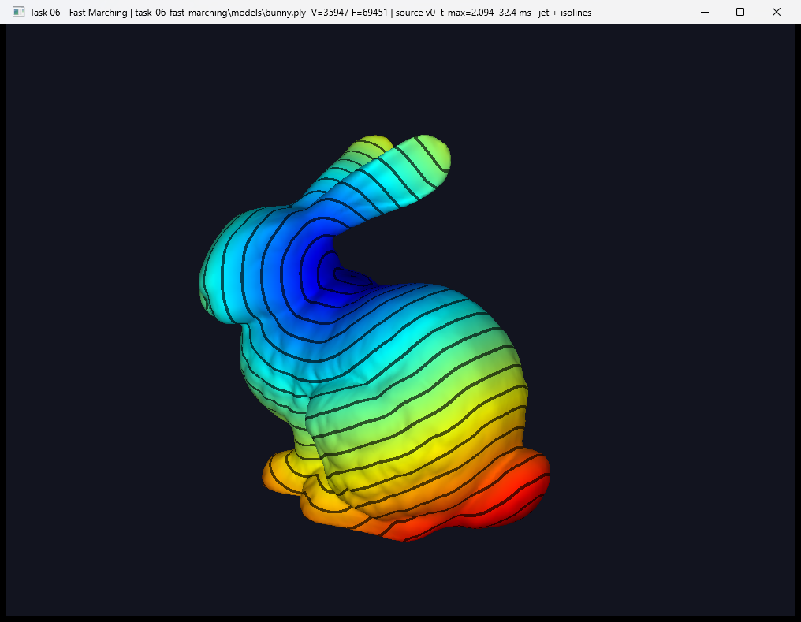
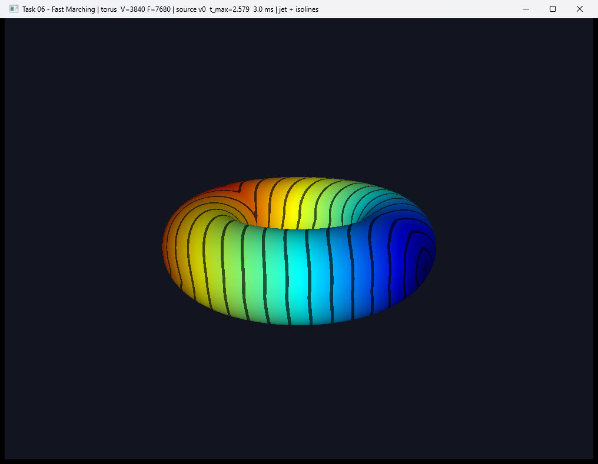
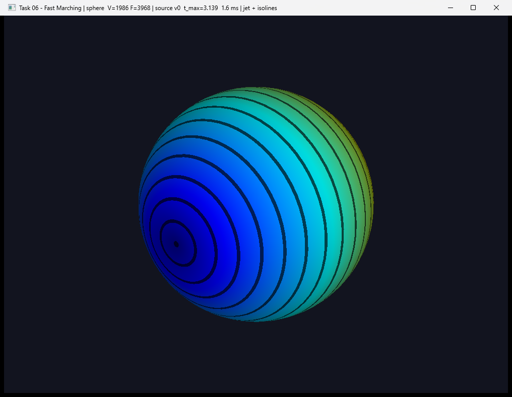

# Task 06 — Fast Marching on triangle meshes

> Implement the Fast Marching algorithm on triangular meshes and test it on your
> generated models (sphere, torus, etc.) and on meshes like the bunny.
>
> The implementation is similar to Dijkstra; the update step is the key
> difference. Check only section 3 of the reference paper:
> https://dl.acm.org/doi/epdf/10.1145/1409625.1409626
>
> Submit an image showing your result, and update your repository.
>
> For displaying the distance map with a color map, you can choose a color map
> from https://github.com/kbinani/colormap-shaders.

**Status:** ✅ done

## Result

Geodesic distance from vertex 0 of the Stanford bunny, `jet` colormap. The
dark bands are isolines: every band edge is a curve of equal geodesic distance,
i.e. the front itself at a given time. They wrap around the ear and the folds
instead of cutting through them, which is what distinguishes distance along
the surface from Euclidean distance:



On the generated torus the front leaves vertex 0 on the outer equator, runs
around the tube in both directions and meets itself on the far side, where the
isolines form a crease:



On the generated sphere, from the pole, the isolines are the parallels:



## The algorithm

`src/fast_marching.cpp`. Sethian 1996; Kimmel & Sethian 1998 for triangulated
surfaces; the update step follows Weber, Devir, Bronstein, Bronstein & Kimmel,
*Parallel Algorithms for Approximation of Distance Maps on Parametric Surfaces*,
ACM TOG 2008, section 3.1.

**The idea.** A fire is lit at the source at `t = 0` and spreads over the
surface at unit speed. The time at which it reaches a vertex is that vertex's
geodesic distance. Formally this is the eikonal equation `|∇t| = 1` with
`t(source) = 0`.

**The structure is Dijkstra's.** Every vertex is `FAR` (untouched, `t = ∞`),
`TRIAL` (has a tentative `t`, sits in a min-heap) or `ALIVE` (`t` is final).
Pop the smallest `t`, mark it ALIVE, re-solve every neighbour that is not yet
ALIVE from the triangles around it; if its `t` improved, push it. Each vertex
becomes ALIVE once, so the whole thing is O(n log n). `std::priority_queue`
has no decrease-key, so an improved vertex is simply pushed again and stale
entries are discarded on pop, because by then the vertex is already ALIVE.

**Where the CHE comes in.** L1 stores half-edge → vertex (`V`) but not the
reverse, and `star()` / `link()` take a half-edge. A vertex → half-edge map is
built once in O(n) (`half_edge_of_vertex`). Then `link(he_of[u])` gives the
neighbours to re-solve, and `star(he_of[v])` gives the triangles `(v, a, b)` to
re-solve them from: for a half-edge `h` leaving `v`, the triangle is
`(V[h], V[next h], V[prev h])`.

**The update step is the whole task.** Dijkstra would set
`t(v) = min(t(a) + |v−a|, t(b) + |v−b|)`: the fire travels along edges. But the
real front crosses triangles through their interior, and along a diagonal the
edge path is a zig-zag that stays longer no matter how fine the mesh gets.
Fast Marching uses **two** ALIVE vertices `a`, `b` of a triangle to recover the
direction of the front and extrapolate it straight through the triangle to `v`:

1. Put `v` at the origin, `x1 = a − v`, `x2 = b − v`, `t1 = t(a)`, `t2 = t(b)`.
2. Model the front as a plane `nᵀx + p = 0` moving at unit speed, so it reaches
   `x` at time `nᵀx + p` and reaches `v` at time `p`.
3. Demand it passes `a` and `b` at their times: `Xᵀn + p·1 = t` (eq. 6).
4. Impose `|n| = 1`. With `Q = (XᵀX)⁻¹`, a 2×2 matrix that depends only on the
   triangle's shape, this is a quadratic in `p` (eq. 10):
   `(1ᵀQ1) p² − 2 (1ᵀQt) p + (tᵀQt − 1) = 0`. The larger root is the front
   arriving after `a` and `b`; the smaller is the same plane running backwards.
5. Accept `p` only if it is **consistent** (`p > max(t1, t2)`) and **monotone**
   (`Q(t − p·1) < 0` componentwise, eq. 15: the front direction falls inside the
   triangle's angle at `v`). Otherwise fall back to the edge update — this is
   Algorithm 2 of the paper. The fallback fires at obtuse angles, where the true
   characteristic runs outside the triangle.

In code `XᵀX = [[e11, e12], [e12, e22]]` with `e11 = x1·x1`, `e12 = x1·x2`,
`e22 = x2·x2`, and every `Q`-form is multiplied by `det = e11·e22 − e12²` so
nothing is divided early. One pleasant identity: `det · 1ᵀQ1 = |a − b|²`.

## Measured error

`--check` on the generated sphere (radius 1, 1 986 vertices), source on the
equator, ground truth the great-circle arc `acos(p·q)`:

| local update | mean error | max error |
|---|---|---|
| edges only (Dijkstra, eq. 16) | 0.1028 | 0.3478 |
| planar front (section 3.1) | 0.0202 | 0.0634 |

Five times smaller by changing one function. The source is on the equator on
purpose: from the pole every geodesic is a meridian, a chain of mesh edges, so
Dijkstra would look exact there (mean error 0.0006) and prove nothing.

Timings on this machine: sphere 1.7 ms, torus 2.8 ms, bunny (35 947 vertices)
34 ms.

## Meshes

Two generated (`sphere`, `torus`) and any triangle-mesh `.ply`. Loading uses
[happly](https://github.com/nmwsharp/happly) (MIT, via vcpkg); `mesh_io.cpp`
centres the model, scales its longest side to 2 and fan-triangulates polygons.
Tested on the Stanford bunny and dragon and on Burkardt's cow, airplane and
teapot; all load as valid CHEs.

The bunny reports 1 113 unreached vertices: the scan has small disconnected
pieces the front cannot jump to. They keep `t = ∞` and are drawn grey.

## Controls

| Key / mouse | Action |
|-----|--------|
| Right click on the mesh | Move the source to the vertex under the cursor |
| Drop a `.ply` on the window | Load it (source resets to vertex 0) |
| `C` | Colormap: `jet` ↔ `plasma` (both from kbinani/colormap-shaders) |
| `I` | Toggle isolines |
| `R` | Source back to vertex 0 |
| `1` / `2` | Solid · wireframe |
| Left drag / scroll | Orbit the camera · zoom |
| `ESC` | Quit |

The title bar shows the mesh, the source vertex, `t_max` and the time the
distance map took.

## Run

```sh
cmake --build --preset <preset> --target task06
./build/<preset>/task-06-fast-marching/task06                          # sphere
./build/<preset>/task-06-fast-marching/task06 torus
./build/<preset>/task-06-fast-marching/task06 models/bunny.ply
./build/<preset>/task-06-fast-marching/task06 sphere models/bunny.ply --check   # stats + error, no window
```

## Layout

```
src/
├── che.hpp / che.cpp            L1 CHE from task 04, data structure only
├── fast_marching.hpp / .cpp     the algorithm: states, heap, planar update
├── primitives.hpp / .cpp        generated test meshes: make_sphere, make_torus
├── mesh_io.hpp / .cpp           load_ply(): happly -> centred, triangulated CHE
└── main.cpp                     viewer: colormap shader, picking, drag-and-drop, --check
models/                          bunny.ply (Stanford), cow.ply
```

## Notes / what I learned

- Fast Marching *is* Dijkstra except for one function. Everything else — the
  three states, the heap, the "fix the smallest and never touch it again" — is
  the same, and it works because the fire only ever adds time.
- One known vertex tells you *when* the front was somewhere; two tell you *which
  way* it was going. That is why the update needs a triangle and why a single
  ALIVE neighbour can only give the edge update.
- The two validity conditions are not numerical hygiene, they encode geometry:
  "the front came from inside this triangle". Drop them and obtuse triangles
  produce times that are too small, and since ALIVE values are never revisited
  the error propagates forever.
- A test can be exact by accident. Measuring from the pole gave a 0.0006 error
  for Dijkstra and would have hidden the entire point of the task.
- Meshes downloaded from the internet are not always manifold. The dragon and
  the airplane have edges shared by three triangles, which leaves the opposite
  array one-directional after the first-match gluing. `build_opposites` now
  breaks any link with `O[O[he]] != he`, so such edges become boundaries and
  `star()` always terminates.
- Not done: virtual unfolding of obtuse triangles (Kimmel & Sethian 1998). The
  fallback handles them safely but with edge-level accuracy; unfolding the
  neighbouring triangle to form an acute virtual one is the standard fix.
