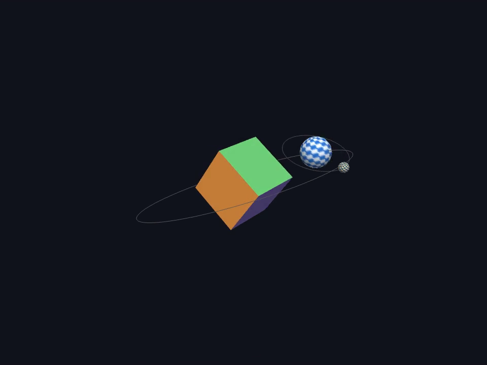

# Task 07 — Camera and Projective Transformations

> In this assignment, you will add the camera to your animated scene.
>
> - Place the camera and compute its view/projection transformations in your animated scene.
> - Pass the corresponding transformation matrices to the vertex shader.
> - Animate the camera to move around, looking at your scene from different positions.
>
> Update your repository and add a link to a short video showing your animated scene.

**Status:** ✅ done

## Result

📹 **Video:** [`docs/animated-camera.mp4`](docs/animated-camera.mp4) — 18 s, one full
camera revolution at normal animation speed.



The scene from [task 05](../task-05-transformations/) continues: a colored cube
spins at the origin, a checkered sphere orbits it, and a small moon orbits the
sphere. Now the camera circles the whole scene, rising and falling while
keeping the cube at the center of the image. The orbit guides make the changing
viewpoint visible.

## Approach

Everything stays in `src/main.cpp`, with the same generated geometry, lighting,
model matrices and controls as task 05. This task remains a standalone executable;
its addition to the root CMake file follows the other tasks.

### Camera position and view

The camera follows a circle of radius 10 in the XZ plane, with one revolution
every 18 seconds. Its height varies smoothly from 2.3 to 4.7:

```cpp
angle = 2 * pi * cameraTime / 18;
cameraPosition = {10 * sin(angle), 3.5 + 1.2 * sin(angle), 10 * cos(angle)};
view = glm::lookAt(cameraPosition, cameraTarget, cameraUp);
```

The target is the world origin and the up direction is positive Y. `lookAt`
builds the world-to-camera transformation: the camera changes position and
orientation, while each object's model matrix still describes its own motion.
The radius leaves room for the moon throughout the orbit at the default window size.

`cameraTime` accumulates elapsed seconds, independently of the frame rate.
It shares the scene's pause and speed controls, but `C` can freeze just the
camera to make its contribution easy to compare. Resuming continues from the
same position; `R` resets both clocks.

### Projection and vertex shader

`glm::perspective` creates a 45° vertical field of view, with near/far planes
at 0.1 and 100. The aspect ratio and viewport follow the framebuffer dimensions
each frame, so resizing does not stretch the scene. A minimized framebuffer is
skipped before computing the projection.

The view and projection matrices are uploaded with `glUniformMatrix4fv` once
per frame; the model matrix changes for each object. The vertex shader applies:

```glsl
gl_Position = uProjection * uView * uModel * vec4(aPos, 1.0);
```

Read right to left: local coordinates → world → camera → clip coordinates.
OpenGL then divides by `w` to produce perspective. Depth testing handles
occlusion as both the objects and the viewpoint move.

## Controls

| Key | Action |
|-----|--------|
| `SPACE` | Pause / resume the scene and camera |
| `C` | Freeze / resume just the camera |
| `↑` / `↓` | Animation speed, 0.1× – 4× |
| `R` | Reset the scene and camera to t = 0 |
| `W` | Toggle wireframe |
| `O` | Toggle the orbit guides |
| `ESC` | Quit |

## Run

```sh
cmake --build --preset <preset> --target task07
./build/<preset>/task-07-projective-transformations/task07
```

On Windows with the MinGW preset:

```powershell
cmake --build --preset windows-mingw --target task07
.\build\windows-mingw\task-07-projective-transformations\task07.exe
```

## Notes / what I learned

- A camera is a coordinate frame. Moving it changes the view matrix for every
  object; it does not require changing their model matrices.
- Position alone is not enough: a moving camera also needs a target and an up
  direction to determine its orientation.
- Separate clocks let the camera stop without stopping the objects, making
  model transformations and view transformations easy to distinguish.
- Projection controls the viewing frustum; the viewport controls where its
  image lands. Both must agree with the framebuffer dimensions.
- The camera completes a loop after 18 seconds, but the objects have their own
  periods, so the whole scene does not necessarily return to its initial pose.
