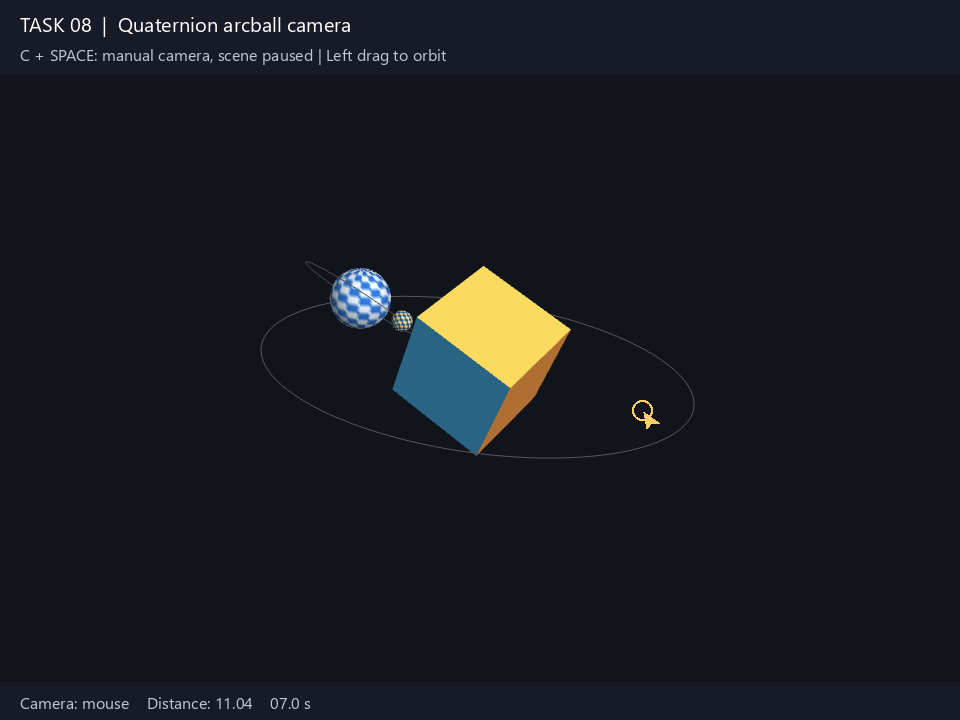

# Task 08 — Quaternion Arcball Camera

> Implement the camera's arcball mouse interaction using quaternions.
>
> - Control the camera by dragging the mouse.
> - Implement zoom in/out with mouse scroll.
> - Implement all camera operations within a struct or class named `camera`.
> - Structure the repository so previous tasks can use the camera.
> - Switch between an animated camera around the scene (Task 07) and mouse control.
>
> Update your repository and add a link to a short video showing your work.

**Status:** ✅ done

## Result

📹 **Video:** [`docs/arcball-camera.mp4`](docs/arcball-camera.mp4) — 24 s:
animated orbit, mouse drags with the scene paused, scroll zoom, and a return
to the animated camera. The recording replays input through the application's
callbacks; the cursor and captions identify each interaction.



The cube, sphere and moon from tasks 05/07 are viewed with a quaternion camera.
Dragging rotates the camera around the scene, including roll near the virtual
ball's rim. Scrolling changes camera distance. `C` switches modes; returning
to animation smoothly blends from the manual pose.

## Approach

### One camera, available to every task

[`common/camera.hpp`](../common/camera.hpp) owns all camera operations and depends
only on GLM. GLFW callbacks in `src/main.cpp` forward input; rendering asks for
`view()` and `projection()` and uploads the matrices to the existing shader:

```glsl
gl_Position = uProjection * uView * uModel * vec4(aPos, 1.0);
```

The `gfx_camera` interface target is exposed through `gfx_common`, which every
task already links. Task 07 now uses the same class for its animated camera.
Other tasks can adopt it with `#include <camera.hpp>` and the forwarding calls
shown in [common/README.md](../common/README.md).

### Arcball and quaternions

The mouse is mapped onto a unit hemisphere centered in the window. X points
right, Y points up, and Z points toward the viewer. Both axes use the smaller
window dimension, so the virtual ball stays circular in a rectangular window.
Points outside the ball are normalized onto its rim.

On press, the camera saves the mapped point `a` and its starting orientation.
For the current mapped point `b`, the arcball quaternion is:

```cpp
delta = quat(dot(a, b), cross(a, b)); // scalar first, then the vector part
orientation = normalize(startOrientation * conjugate(delta));
```

This uses the sphere/quaternion construction of
[Shoemake's Arcball Rotation Control](https://research.cs.wisc.edu/graphics/Courses/559-f2001/Examples/Gl3D/arcball-gems.pdf).
The conjugate turns the virtual scene rotation into a camera rotation, so the
scene follows the drag. Every event is measured from the original press, making
the result independent of the number of intermediate mouse events. Returning
to the press position restores the starting orientation.

The quaternion maps camera axes into world coordinates:

```cpp
eye  = target + orientation * vec3(0, 0, distance);
view = mat4_cast(conjugate(orientation)) * translate(-eye);
```

Rotating the complete camera frame also rotates its up direction. There is no
Euler-angle accumulation or pitch clamp, and the target remains centered even
when the camera rolls or passes over the scene.

### Zoom and modes

Scroll scales the distance by `exp(-0.12 * steps)`, clamped to 0.5–50. It moves
the camera without changing the field of view. Mouse dragging and scrolling
take control immediately from the current animated pose.

In animated mode, the camera follows the 18-second orbit from task 07. Enabling
it preserves the manual zoom and interpolates the orientation with `slerp` over
0.6 seconds, so switching does not snap. `SPACE` pauses the scene and automatic
camera motion; manual input still works, which makes the camera rotation easy
to distinguish from object animation.

Mouse mapping uses GLFW window coordinates; projection uses framebuffer pixels.
Release, focus loss and window resize end a drag. A minimized framebuffer is
skipped before rendering.

## Controls

| Key / mouse | Action |
|-------------|--------|
| Left drag | Arcball camera rotation; switches to mouse mode |
| Scroll up / down | Zoom in / out; switches to mouse mode |
| `C` | Switch animated camera ↔ mouse camera |
| `SPACE` | Pause / resume scene and automatic camera motion |
| `↑` / `↓` | Animation speed, 0.1×–4× |
| `R` | Reset scene and camera; keep the selected camera mode |
| `W` | Toggle wireframe |
| `O` | Toggle orbit guides |
| `ESC` | Quit |

## Run

```sh
cmake --build --preset <preset> --target task08
./build/<preset>/task-08-arcball-camera/task08
```

On Windows:

```powershell
cmake --build --preset windows-mingw --target task08
.\build\windows-mingw\task-08-arcball-camera\task08.exe
```

Camera checks:

```sh
cmake --build --preset windows-mingw --target camera_tests
ctest --test-dir build/windows-mingw --output-on-failure
```

## Notes / what I learned

- An arcball turns two mouse positions into a 3D rotation. The drag changes a
  quaternion; it does not add separate yaw and pitch angles.
- Quaternion multiplication order depends on which frame the rotation belongs
  to. Here the drag is expressed in camera coordinates, so it multiplies on the right.
- A camera must rotate its up vector as well as its position to support roll.
- Saving the press orientation makes dragging reversible and independent of
  the mouse event rate. Normalization keeps repeated rotations orthonormal.
- A shared camera needs mathematical operations, not a dependency on a particular
  window or scene. The callbacks are adapters, and the same class works in task 07.
